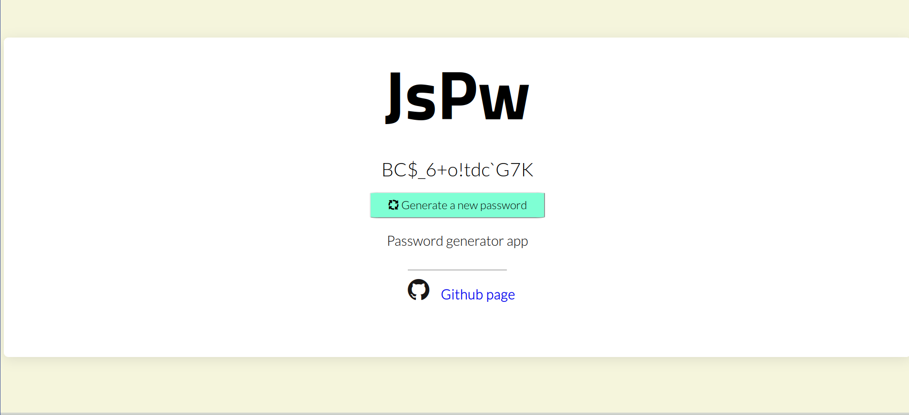
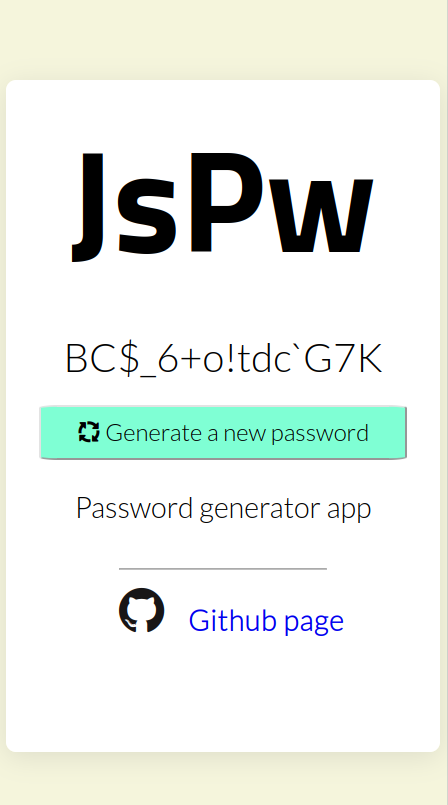

# JsPw

A simple password generator created in Vanilla JavaScript. 

Live version of the app can be found [here:](https://jspw.netlify.app/)

## Desktop view

### Mobile view

### Testing / Linter tools used for app:

- Prettier to maintain properly formatted and organized code

### Completed app tasks:

- [x] Perfect UI and UX design for app
- [x] Make app responsive for the majority of user platforms

### Future app goals:

- [ ] Include JS framework backend for project
- [ ] Include working copy button inside the app
- [ ] Create a 2FA code generator
- [ ] Include QR reader for 2FA generator option

