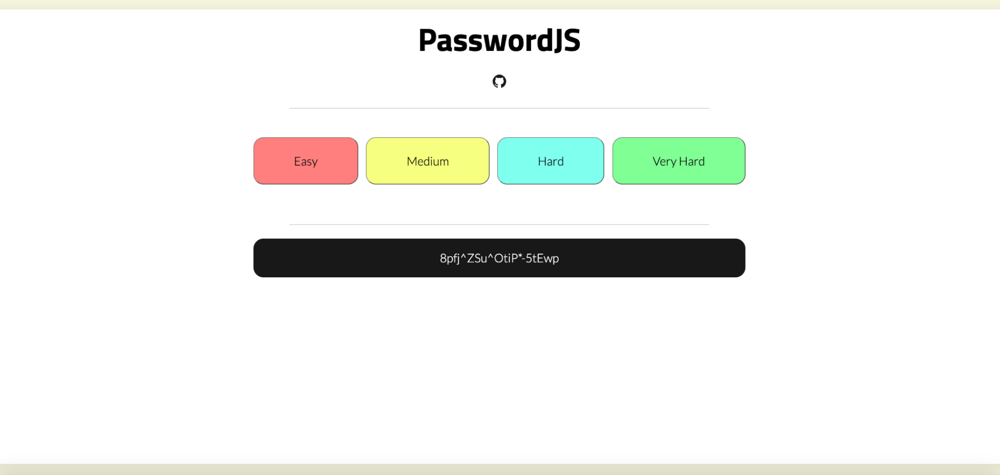
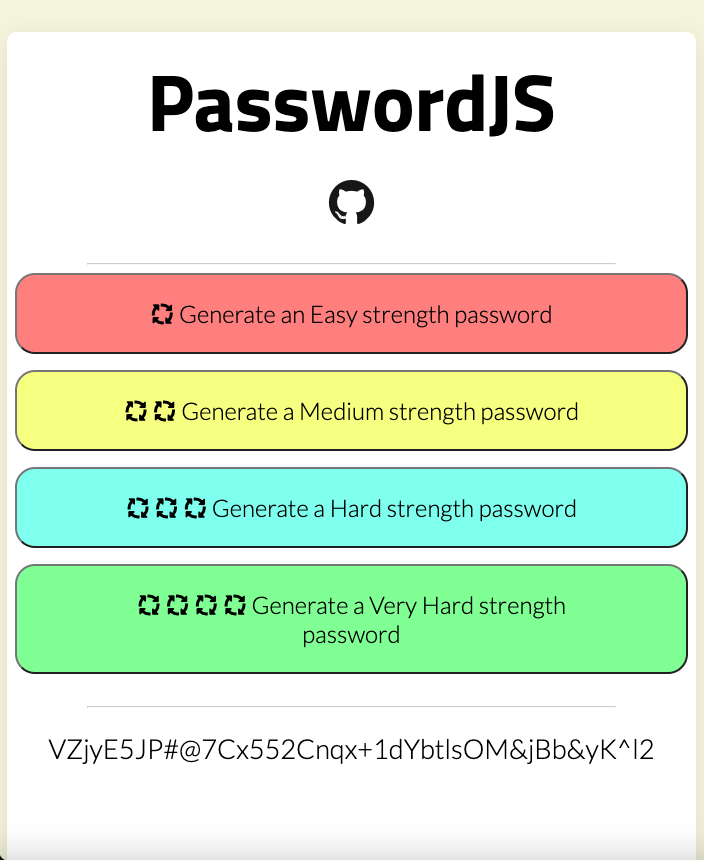

# PasswordJS

A password generator webapp created in Vanilla JavaScript. Autogenerate a password with varying degrees of difficulty. 

Live version of the app can be found [here:](https://passwordjs.netlify.app/)

## Desktop view

### Mobile view

### Testing / Linter tools used for app:

- Prettier to maintain properly formatted and organized code

### Completed app tasks:

- [x] Perfect UI and UX design for app
- [x] Make app responsive for the majority of user platforms
- [x] Add more password options inside the app 

### Future app goals:

- [ ] Include a JavaScript framework to work as a backend for the project
- [ ] Add multiple tests for the project (unit tests, usability tests, etc)